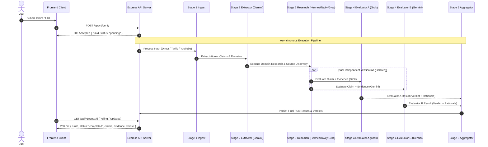

# Baatmeedar — Architectural Documentation

## Executive Summary

**Baatmeedar** is an evidence-transparent AI newsroom verification platform designed to evaluate claims from multiple input types (direct text statements, web article URLs, and YouTube video URLs) using a structured 5-stage workflow. 

This document defines the system architecture, separating the **current implemented browser client** from the **Node.js Express backend service**, and detailing the trust boundaries, state machine, evidence provenance model, and verifier isolation design.

---

## 1. System Overview & Components

```mermaid
graph TD
    Client["Browser Frontend (HTML/CSS/JS)<br/>[USE_MOCK = true | API Client]"] -->|REST API Requests| API["Express.js API Backend<br/>(port 5000)"]
    
    subgraph Security Boundary
        API --> Auth["Supabase Auth / JWT Validation"]
        API --> Middleware["Security Middleware<br/>(Helmet, Rate Limiter, Zod Schemas)"]
    end
    
    subgraph Workflow Engine (5 Stages)
        Middleware --> S1["Stage 1: Input Processor<br/>(Statement, Tavily Extract, YouTube API)"]
        S1 --> S2["Stage 2: Claim Extractor<br/>(Gemini Flash API)"]
        S2 --> S3["Stage 3: Evidence Research<br/>(Hermes Orchestrator + Tavily + Groq/Gemini)"]
        S3 --> S4["Stage 4: Independent Evaluators<br/>(Grok xAI & Gemini)"]
        S4 --> S5["Stage 5: Verdict Aggregator<br/>(supported | contradicted | inconclusive)"]
    end
    
    subgraph Data & Storage Layer
        S5 --> DB[("Supabase PostgreSQL<br/>(Runs, Claims, Evidence, Verdicts)")]
    end
```

### Component Responsibilities

1. **Browser Frontend (`src/`)**:
   - Built with Vanilla HTML5, CSS3, and JavaScript.
   - Designed with a newspaper visual theme emphasizing evidence transparency.
   - Operating Mode: When `USE_MOCK = true`, uses client-side simulated state machine and mock data. When connected to backend, issues asynchronous REST calls to `/api/v1/verify`.

2. **Express REST API Backend (`server/src/`)**:
   - Entry points: `app.js` and `server.js`.
   - Handles request routing, Zod payload validation, authentication verification, and error handling.
   - Manages verification run lifecycle, orchestrating stages asynchronously.

3. **Provider Adapters (`server/src/adapters/`)**:
   - Encapsulates third-party service calls behind standardized interfaces:
     - **Tavily Adapter**: Performs web extractions and search queries.
     - **YouTube Transcript Adapter**: Retrieves video transcript captions.
     - **Gemini Adapter**: Handles claim extraction (Stage 2) and Evaluator B assessment (Stage 4).
     - **Groq Adapter**: Fast Llama-3 inference engine for Stage 3 supporting research.
     - **Grok (xAI) Adapter**: Evaluator A independent assessment (Stage 4).

4. **Persistence Layer (`server/src/db/` & `server/src/repositories/`)**:
   - PostgreSQL via Supabase client with row-level security (RLS).
   - In-memory repository fallback for stateless or local development runs.

---

## 2. The Five-Stage Verification Workflow



---

## 3. State Machine & Lifecycle Management

Verification runs follow a strict deterministic finite state machine:

```
 [ PENDING ] ──► [ EXTRACTING ] ──► [ RESEARCHING ] ──► [ VERIFYING ] ──► [ COMPLETED ]
      │                │                  │                 │
      └────────────────┴──────────────────┴─────────────────┴─────────► [ FAILED ]
```

### State Machine Transition Rules

| State | Trigger / Action | Next State | Error / Failure Path |
| :--- | :--- | :--- | :--- |
| **`pending`** | Run created and stored in queue/db. | `extracting` | `failed` (Validation error) |
| **`extracting`** | Input body parsed (Text/Article/YouTube); claims extracted via Gemini. | `researching` | `failed` (Extraction timeout / Bad input) |
| **`researching`** | Domain search via Tavily & Groq/Gemini context analysis. | `verifying` | `failed` (Provider outage / Zero evidence) |
| **`verifying`** | Concurrent evaluation by Grok (xAI) and Gemini. | `completed` | `failed` (Evaluator exception) |
| **`completed`** | Verdicts aggregated (`supported`, `contradicted`, `inconclusive`). | Final | — |
| **`failed`** | Error captured, logged with context, saved to DB. | Final | — |

---

## 4. Evidence Provenance & Provenance Ledger

To eliminate opaque AI decisions, Baatmeedar binds every claim to traceable evidence objects using unique identifiers:

```json
{
  "claimId": "clm_8f92a10c",
  "statement": "Global coffee production declined by 15% in 2025.",
  "domain": "agriculture_finance",
  "evidence": [
    {
      "evidenceId": "ev_3a19b882",
      "sourceUrl": "https://example-agriculture-report.org/coffee-2025",
      "sourcePublisher": "International Coffee Organization",
      "publishedTimestamp": "2025-11-14T08:30:00Z",
      "retrievedTimestamp": "2026-08-10T14:20:00Z",
      "snippet": "Severe weather conditions led to a 14.8% drop in global coffee yields during the 2025 harvesting season.",
      "relevanceScore": 0.94
    }
  ],
  "evaluators": {
    "evaluator_grok": {
      "model": "grok-2",
      "verdict": "supported",
      "confidence": 0.91,
      "reasoning": "The retrieved report from ICO explicitly confirms a 14.8% decline, which closely aligns with the 15% claim."
    },
    "evaluator_gemini": {
      "model": "gemini-1.5-pro",
      "verdict": "supported",
      "confidence": 0.93,
      "reasoning": "Primary industry statistics document a ~15% coffee yield reduction due to climate factors."
    }
  },
  "finalVerdict": "supported"
}
```

---

## 5. Verifier Isolation & Independent Panel Design

> [!IMPORTANT]
> **Independent Stage 4 Evaluator Isolation**
> Evaluator A (**Grok by xAI**) and Evaluator B (**Gemini by Google**) receive only the extracted atomic claim and the retrieved Stage 3 evidence cards.
> Neither evaluator is informed of the other model's identity, prompt, or output. This guarantees unbiased, non-collusive verification.

### Why `inconclusive` is a Core Product Feature

Baatmeedar deliberately outputs `inconclusive` under three explicit conditions:
1. **Evidence Deficiency**: Insufficient credible web sources exist to confirm or refute the claim.
2. **Irreconcilable Source Conflict**: High-credibility sources directly contradict each other with equal weight.
3. **Evaluator Disagreement**: Grok and Gemini reach conflicting verdicts (e.g., one evaluates `supported` while the other evaluates `contradicted`), signaling genuine ambiguity.

---

## 6. Distinguishing System Roles (Groq vs. Grok)

To maintain technical accuracy across documentation and codebase maintainers:

- **Groq** (`GROQ_API_KEY`): An ultra-fast LLM inference hosting engine (utilizing Llama models) deployed in **Stage 3** for rapid context processing and information summarization.
- **Grok** (`XAI_API_KEY`): A frontier AI model developed by xAI utilized in **Stage 4** as Evaluator A for independent claim verification.

---

## 7. Security Boundaries & Risk Controls

1. **API Key Containment**: No secret keys (`SUPABASE_SERVICE_ROLE_KEY`, `GEMINI_API_KEY`, `GROQ_API_KEY`, `TAVILY_API_KEY`, `XAI_API_KEY`) are exposed to the browser client.
2. **Input Sanitization**: User inputs (claims, URLs) pass through Zod schemas to prevent prompt injection and SSRF (Server-Side Request Forgery) attacks.
3. **CORS & Rate Limiting**: Strict CORS origin checking and IP-based rate limiting via Express middleware.
4. **Row-Level Security (RLS)**: Database tables in Supabase restrict user access to their own verification runs.
